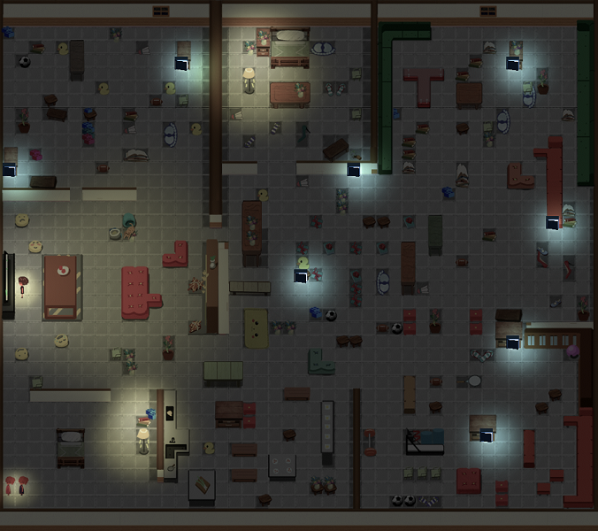

# Slip Carefully

Our pixel-style game for Global Game Jam 2019.

Slip Carefully is a 1 vs. 2 fast-paced asymmetric action game with pixel art. In this game, home is where you have to find your game consoles all the time. Children need to find the game consoles at night but your mom is going to catch you. However, be careful, the floor is slippery!

[Download and Play!](https://globalgamejam.org/2019/games/slip-carefully)

# Control

3 controllers (either Xbox controller or DualShock 4 controller) are required to play this game.

- __Left Joystick__: Slip (Move)
- __A__ (Xbox) or __Circle__ (DS4): Confirm/Struggle

# Team

__Team Cellular Automata__

Designer:

- [Zhiguo Lai](https://www.laizhiguo.com/) ([@ZhiguoLai](https://github.com/ZhiguoLai))

Programmer:

- [Jiajun Tan](https://www.jiajun-tan.com/) ([@tplatina](https://github.com/tplatina))
- [Kevin Han](https://about.commouse.me) ([@ComMouse](https://github.com/ComMouse))

Artists:

- [Boyi Liu](https://www.boyi.design/)
- [Yoli Shen](https://www.artstation.com/yoli)

Sound & Producer:
- [Ava Tan](https://www.chenchentan.com/)

# Tech Stack

- [Unity](https://unity3d.com/)
- [Tiled](https://www.mapeditor.org/)
